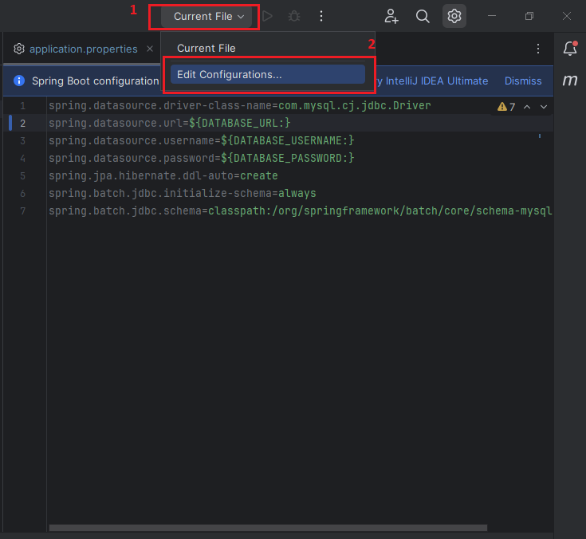

## Project folder structure


## Note:
- The server runs on port 8080 with domain: http://localhost:8080
- Before you run this project, you must go to .\src\main\java\com\dtvn\springbootproject\sql, open CreateTable.sql, execute all sql in order from top to bottom

## API DESIGN

### Base URL

The base URL for all API requests is:

`https://localhost:8080/api/v1`

### Authentication
<details>
<summary>POST /api/v1/auth/login</summary>

Login to the system

Header: { "Content-Type": "application/json" },

Body:
```json
{
   "email":"quyet1@mail.com",
   "password":"Quyetka@123"
}
```

Response if success:
```json
{
    "access_token": "xxxxxxxxxxx.xxxxxxxxxxx.xxxxxxxxxxx",
    "refresh_token": "xxxxxxxxxxx.xxxxxxxxxxx.xxxxxxxxxxx",
    "code": 200,
    "message": "Login successfully",
    "username": "Phạm Quyết",
    "access_token_expires_in": 1702103352000
}
```
Response if failed:
```json
{
    "access_token": null,
    "refresh_token": null,
    "code": 400,
    "message": "Email or password is incorrect.",
    "username": null,
    "access_token_expires_in": 0
}
```
Response if account registered before but be deleted:
```json
{
    "access_token": null,
    "refresh_token": null,
    "code": 400,
    "message": "This account has been deleted.",
    "username": null,
    "access_token_expires_in": 0
}
```
</details>

### Account Management
<details>
<summary> GET /api/v1/accounts/getAllAccount </summary>

#### Description
This endpoint retrieves a list of all accounts.

#### Request

HTTP Request

`GET http://localhost:8080/api/v1/accounts/getAllAccount`

#### Response
- `status: 200 OK`
- `message: ""`
- `data` (object)
   - `content` (array)
      - `accountId` (number)
      - `firstname` (string)
      - `lastname` (string)
      - `email` (string)
      - `role` (string)
      - `address` (string)
      - `phone` (string)
   - `pageable` (object)
      - `pageNumber` (number)
      - `pageSize` (number)
      - `sort` (object)
         - `empty` (boolean)
         - `sorted` (boolean)
         - `unsorted` (boolean)
      - `offset` (number)
      - `unpaged` (boolean)
      - `paged` (boolean)
   - `last` (boolean)
   - `totalElements` (number)
   - `totalPages` (number)
   - `size` (number)
   - `number` (number)
   - `sort` (object)
      - `empty` (boolean)
      - `sorted` (boolean)
      - `unsorted` (boolean)
   - `first` (boolean)
   - `numberOfElements` (number)
   - `empty` (boolean)
   - `code` (number)

#### Authorization `Bearer Token`
</details>

<details>
<summary> POST /api/v1/accounts/registerAccount </summary>

**Description**
This endpoint allows you to register a new account.

**HTTP Request**
- Method: POST
- URL: `http://localhost:8080/api/v1/accounts/registerAccount`

**Authorization** `Bearer Token`

**Request Body**

- Type: Raw
   - `email` (text, required): The email of the user.
   - `password` (text, required): The password for the account.
   - `firstname` (text, required): The first name of the user.
   - `lastname` (text, required): The last name of the user.
   - `role` (text, required): The role of the user.
   - `address` (text, required): The address of the user.
   - `phone` (text, required): The phone number of the user.

**Response**

- Status: 200
- Body:

    ``` json
        {
            "message": "",
            "data": {
                "accountId": 0,
                "firstname": "",
                "lastname": "",
                "email": "",
                "role": "",
                "address": "",
                "phone": ""
            },
            "code": 0
        }
     ```

</details>

<details>
<summary> GET /api/v1/accounts/getRoles </summary>

**Description** 
This endpoint makes an HTTP GET request to retrieve the roles associated with accounts. The request does not contain a request body.

**Response**

- Status: 200
- Data:
   - An array of roles, where each role object contains:
      - roleId: The ID of the role.
      - roleName: The name of the role.
- message: A message, if any.
- code: A status code.
</details>

<details>
<summary>PUT /api/v1/accounts/update/{id}</summary>

**Description**

This endpoint allows updating account information using an HTTP PUT request. The request should be sent to [http://localhost:8080/api/v1/accounts/update](http://localhost:8080/api/v1/accounts/update) with the 'id' parameter specifying the account ID to be updated. The request body should be in raw format and include the fields email, firstname, lastname, role, address, and phone.

**Request Body**
- email (string): The email of the account.
- firstname (string): The first name of the account holder.
- lastname (string): The last name of the account holder.
- role (string): The role of the account holder.
- address (string): The address of the account holder.
- phone (string): The phone number of the account holder.

**Response**

The response will have a status code of 200 and include the following data:

- message (string): A message related to the update operation.
- data (object): An object containing the updated account information.
   - accountId (number): The ID of the updated account.
   - firstname (string): The updated first name.
   - lastname (string): The updated last name.
   - email (string): The updated email.
   - role (string): The updated role.
   - address (string): The updated address.
   - phone (string): The updated phone number.
- code (number): A code related to the update operation.
</details>

<details>
<summary>PATCH /api/v1/accounts/deleteAccount/{id}</summary>

**Description**

This endpoint is used to send an HTTP PATCH request to delete a specific account by providing the account ID as a query parameter.

**Request Parameters**

- `id` (query parameter) : The ID of the account to be deleted.


**Response**

- `message` : A message indicating the outcome of the request.
- `data` : The data related to the deleted account, which is null in this case.
- `code` : A status code indicating the result of the operation.


The last execution of this request returned a status code of 200 with an empty message and null data.
</details>

### Campaign Management
<details>
<summary>GET /api/v1/campaigns/getCampaign/{name}</summary>

**Description**

This endpoint retrieves a specific campaign by name.

**Request**
- Method: GET
- URL: `http://localhost:8080/api/v1/campaigns/getCampaign`
- Query Parameters:
    - name (string, required): The name of the campaign to retrieve.
- Authorization: Bearer Token
**Response**

- Status: 200
- Body:

    ``` json
      {
        "message": "",
        "data": {
          "content": [
            {
              "name": "",
              "startDate": "",
              "endDate": "",
              "budget": 0,
              "usedAmount": 0,
              "usageRate": 0,
              "status": true,
              "bidAmount": 0
            }
          ],
          "pageable": {
            "pageNumber": 0,
            "pageSize": 0,
            "sort": {
              "empty": true,
              "sorted": true,
              "unsorted": true
            },
            "offset": 0,
            "paged": true,
            "unpaged": true
          },
          "last": true,
          "totalElements": 0,
          "totalPages": 0,
          "size": 0,
          "number": 0,
          "sort": {
            "empty": true,
            "sorted": true,
            "unsorted": true
          },
          "first": true,
          "numberOfElements": 0,
          "empty": true
        },
        "code": 0
      }
    
     ```
</details>
<details>
<summary>POST /api/v1/campaigns/createCampagin</summary>

**Description**

This endpoint allows you to create a new campaign.

**Request Body**

- form-data
    - file (file): The file to be uploaded for the campaign.
    - data (text): Additional data for the campaign.

**Response**

- Status: 200
- message (string): A message related to the response.
- data (object)
    - campaignDTO (object): Details of the created campaign.
        - name (string): Name of the campaign.
        - startDate (string): Start date of the campaign.
        - endDate (string): End date of the campaign.
        - budget (number): Budget allocated for the campaign.
        - usedAmount (number): Amount used from the budget.
        - usageRate (number): Rate of budget usage.
        - status (boolean): Status of the campaign.
        - bidAmount (number): Bid amount for the campaign.
    - creativesDTO (object): Details of the campaign creatives.
        - title (string): Title of the creative.
        - description (string): Description of the creative.
        - imageUrl (string): URL of the creative image.
        - finalUrl (string): Final URL for the creative.
- code (number): Response code.
</details>

## Mock account:

ENDPOINT: POST /api/v1/auth/login
```json
{
  "email": "quyet@mail.com",
  "password": "Quyetka@123"
}
```

### Account Management


## Running the Project
To run the project:

Before you run this project, let's config environment for this project.
1. Install plugin 'EnvFile'
   
2. Add configuration
   
   
3. Setting for configuration we've just created
   
4. Go to .env.example file, rename it to .env and pass appropriate values to all variable in that file.
